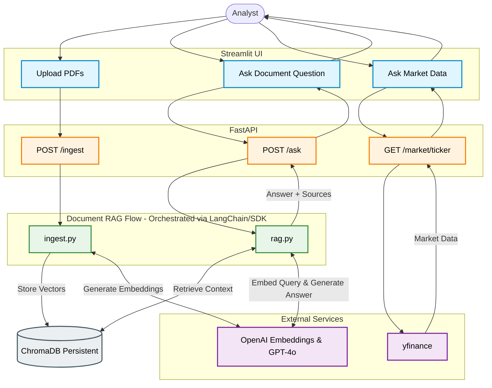

# Finance RAG – Quarterly Financial Reports Architecture

## 1. PROJECT OBJECTIVE

**The Business Problem:**
An investment advisory firm's analysts spend countless hours reading through quarterly financial results to answer routine questions about revenue, margins, and management commentary. A standard large language model cannot answer these questions accurately because it has never seen the firm's specific internal or recent financial PDFs. 

The system should allow an analyst to:
- Upload 3–4 quarterly financial PDFs.
- Index the documents into a searchable vector database.
- Ask questions in natural language.
- Retrieve relevant document chunks based on meaning.
- Generate answers using GPT-4o based *only* on the retrieved chunks.
- Show the source PDF filename and page number for every answer so the analyst can verify it.
- Refuse to answer when the information is not present in the documents, rather than hallucinating.

**Optional Market-Data Capability:**
In addition to the RAG system, the application integrates `yfinance` to fetch live or historical market data. 

**Clearly Distinguish:**
- **DOCUMENT-BASED INFORMATION:** Addressed via the RAG pipeline reading uploaded PDFs (e.g., "What was the profit last quarter?").
- **MARKET INFORMATION:** Addressed via the `yfinance` integration (e.g., "What is the current share price?").

---

## 2. TECHNOLOGY REQUIREMENTS

| Component | Technology | Purpose |
| :--- | :--- | :--- |
| **Language** | Python 3.10+ | Core programming language |
| **Backend API** | FastAPI | High-performance API framework for endpoints |
| **Frontend UI** | Streamlit OR Gradio | Interactive web application for analysts |
| **PDF Reading** | pypdf OR pdfplumber OR LangChain PyPDFLoader | Extracting text and page metadata from PDFs |
| **Text Splitter** | Recursive Character Text Splitter | Chunking extracted text into manageable pieces |
| **Embeddings** | OpenAI text-embedding-3-small | Converting text chunks into vector representations |
| **Vector Database** | ChromaDB | Storing and searching vector embeddings |
| **LLM** | GPT-4o | Generating grounded answers from retrieved context |
| **Orchestration** | LangChain OR LangGraph OR plain openai SDK | Tying together retrieval, prompt building, and the LLM |
| **Environment** | python-dotenv | Securely loading environment variables (API keys) |
| **Market Data** | yfinance | Fetching live/historical stock information |
| **Server** | Uvicorn | ASGI web server to run FastAPI |

**Required RAG Configuration:**
- `chunk_size` = 1200 characters
- `chunk_overlap` = 200 characters

*1200-character chunks with 200-character overlap helps keep whole financial tables inside a single chunk since PDF tables lose their alignment when converted to plain text.*

**LLM Configuration:**
- **GPT-4o temperature:** 0–0.2 (Ensures highly deterministic and factual responses).

**Retrieval Configuration:**
- `top_k` = 4 or 5 (Retrieves the 4 to 5 most relevant chunks).

---

## 3. HIGH-LEVEL ARCHITECTURE

```text
                    ANALYST
                       |
                       v
                 STREAMLIT UI
                       |
                     HTTP
                       |
                       v
                 FASTAPI BACKEND
                       |
          +------------+-------------+
          |                          |
          v                          v
      INGESTION                    QUERY
       ROUTE                       ROUTE
          |                          |
          v                          v
     ingest.py                    rag.py
          |                          |
          v                          v
   PDF Processing              Retrieval
          |                          |
          v                          v
      Chunking                   ChromaDB
          |                          |
          v                          v
    Embeddings                  Top 4–5 Chunks
          |                          |
          v                          |
      ChromaDB <--------------------+
          |
          v
       GPT-4o
          |
          v
 Answer + Sources
```

---

## 4. DOCUMENT INGESTION FLOW

**Pre-Requisite: Data Collection Strategy**
- **Task:** Download 3 to 4 consecutive quarterly results PDFs for a single listed company.
- **Suggested Companies:** Infosys, TCS, HDFC Bank, Reliance Industries, Tata Motors, Asian Paints, Apple, Microsoft.
- **Data Source:** Company Investor Relations pages or stock exchange filings (BSE, NSE, SEC EDGAR).
- **Content Preference:** Prefer press releases or fact sheets over full audited statements, as they contain richer management commentary.
- **CRITICAL OCR CHECK:** Before writing any code, open each PDF and attempt to highlight/select the text with your mouse. If the text cannot be selected, the file is a scanned image. Normal PDF readers will return empty text. **Do not attempt OCR** in this assignment. Instead, pick a different file or company.

**Exact Flow:**
Analyst
→ Streamlit PDF Upload
→ POST `/ingest`
→ FastAPI
→ `ingest.py`
→ PDF Loader
→ Page-by-page Text Extraction
→ Metadata Preservation
→ Recursive Character Text Splitting
→ Orchestration (LangChain / SDK)
→ OpenAI `text-embedding-3-small`
→ ChromaDB
→ Persistent `chroma_db/` folder

**Metadata Preservation:**
It is critical to preserve the **filename** and **page number** for every chunk during ingestion. This metadata is necessary to provide source citations in the final answer, allowing analysts to manually verify the LLM's claims against the original document.

**Capabilities:**
- The system supports processing one or more PDF files at a time.
- After indexing, it returns a clear confirmation such as: *"3 files processed, 214 chunks stored."*

---

## 5. QUESTION / RETRIEVAL FLOW

**Exact Flow:**
Analyst
→ Streamlit Question
→ POST `/ask`
→ FastAPI
→ `rag.py`
→ Embed Question
→ ChromaDB Similarity Search
→ Retrieve Top 4–5 Chunks
→ Orchestration (LangChain / SDK) Builds Grounded Prompt
→ GPT-4o
→ Answer
→ Sources

**Sources Requirement:**
Sources must be returned with the answer and include:
- `filename`
- `page number`

**Note:** GPT-4o receives *only* the retrieved context (the top 4–5 chunks) rather than the entire PDF. This saves tokens, reduces noise, and forces the model to rely solely on the most relevant text.

---

## 6. GROUNDED GENERATION

**Required System Behavior:**
*"Answer only from the context provided below. If the context does not contain the answer, reply that the information is not available in the uploaded documents. Do not guess or invent information."*

**Core Concepts:**
- **Context:** The specific text chunks retrieved from ChromaDB that are injected into the prompt.
- **Prompt:** The structured text sent to the LLM containing the system instructions, the context, and the user's question.
- **Grounding:** Tying the model's response strictly to the provided context, preventing it from using its pre-trained knowledge.
- **Hallucination:** When the model invents facts. Grounding prevents this.
- **Temperature:** Set to 0–0.2 to minimize randomness and creativity, maximizing factual adherence.
- **Why retrieval quality matters:** If ChromaDB retrieves the wrong chunks, the context will not contain the answer, and the properly grounded LLM will (correctly) refuse to answer, even if the information exists elsewhere in the PDF.

---

## 7. HONEST REFUSAL

**Dedicated Flow:**
Question
→ Retrieval
→ Context does not contain answer
→ GPT-4o
→ Honest refusal

**Example Trap Question:**
*"What is the CEO's personal shareholding in 2015?"*

**Expected Response:**
*"The information is not available in the uploaded documents."*

**Mandatory Rule:** 
The system must not invent a financial figure under any circumstances.

---

## 8. PERSISTENCE

**Flow:**
ChromaDB
→ `chroma_db/` (Directory on disk)

**Explanation:**
Index PDFs
→ stop application
→ restart application
→ previously indexed documents remain searchable
→ no re-upload required

This persistence ensures the database survives a restart, saving time and API costs. **This is mandatory.**

---

## 9. FASTAPI ARCHITECTURE

FastAPI serves as the backend API layer. The API routes call reusable logic from `ingest.py` and `rag.py` rather than duplicating the logic inside the route handlers.

**Endpoints:**

**1. POST `/ingest`**
- **Input:** One or more PDF files
- **Output:**
```json
{
  "files": 3,
  "chunks": 214
}
```

**2. POST `/ask`**
- **Input:**
```json
{
  "question": "What was the operating margin in Q3?",
  "top_k": 4
}
```
- **Output:**
```json
{
  "answer": "The operating margin in Q3 was 21.4%.",
  "sources": [
    {
      "file": "Q3_Earnings_Release.pdf",
      "page": 7
    }
  ]
}
```

**3. GET `/stats`**
- **Return:**
  - Collection name
  - Total chunks
  - Embedding model
  - LLM model

**Execution:**
FastAPI should be run with:
`uvicorn api.main:app --reload`

**Swagger Documentation:**
Available automatically at: `http://localhost:8000/docs`

---

## 10. STREAMLIT / GRADIO ARCHITECTURE

Streamlit or Gradio acts as the frontend client.

**Upload Flow:**
Upload PDFs
↓
Index button
↓
POST `/ingest`
↓
Indexing confirmation

**Question Flow:**
Question textbox
↓
Ask button
↓
POST `/ask`
↓
Answer
↓
Sources

Also include a small, visually distinct market-data section for `yfinance`.

---

## 11. YFINANCE ARCHITECTURE

**Market-Data Flow:**
Analyst
→ Streamlit
→ FastAPI market-data endpoint/service
→ yfinance
→ Market Data
→ Streamlit

**Possible Information:**
- Current share price
- Historical share price
- Market capitalization if available

**IMPORTANT:**
`yfinance` must NOT replace the RAG system. It is an additional project feature, not a replacement for the assignment's required endpoints.

**Examples:**
- *"What was the latest quarterly revenue?"* → **DOCUMENT RAG** (PDF)
- *"What was net profit in Q3?"* → **DOCUMENT RAG** (PDF)
- *"What is the current share price?"* → **MARKET DATA** (yfinance)
- *"What was the share price 30 days ago?"* → **MARKET DATA** (yfinance)

**Endpoint Design:**
Use a clean endpoint such as:
`GET /market/{ticker}`

Clearly label this section in the UI as **"MARKET DATA"** and not "DOCUMENT RAG".

---

## 12. COMPONENT RESPONSIBILITIES

| Component | File | Responsibility |
| :--- | :--- | :--- |
| Streamlit UI | `app.py` | Analyst-facing frontend; handles file uploads, user inputs, and displays answers. |
| FastAPI | `api/main.py` | API server managing HTTP requests, routing, and response formatting. |
| Ingestion Logic | `ingest.py` | Core logic for parsing PDFs, chunking, embedding, and storing data. |
| RAG Logic | `rag.py` | Core logic for similarity search, prompt formatting, and calling the LLM. |
| PDF loader | `ingest.py` | Reading PDFs and extracting text alongside page numbers. |
| Recursive splitter | `ingest.py` | Breaking down large text into smaller, meaningful 1000-character chunks. |
| Embedding model | `ingest.py` / `rag.py` | Vectorizing text using OpenAI `text-embedding-3-small`. |
| ChromaDB | `chroma_db/` | Persisting vector embeddings and serving similarity search queries. |
| GPT-4o | `rag.py` | Generating the final grounded answer based on the provided chunks. |
| yfinance | `api/main.py` / Service | Fetching real-time or historical market metrics. |
| dotenv | Throughout | Loading `OPENAI_API_KEY` and other configurations safely. |
| Uvicorn | CLI | Running the FastAPI web server. |
| Orchestration | `ingest.py` / `rag.py` | LangChain or SDK chaining document loading, vector storage, and LLM prompting. |

---

## 13. PROJECT DIRECTORY

```text
finance-rag/
├── app.py
├── ingest.py
├── rag.py
├── api/
│   └── main.py
├── data/
├── chroma_db/
├── requirements.txt
├── .env
├── .env.example
├── .gitignore
└── README.md
```

**File Details & Responsibilities:**
- `app.py`: Streamlit / Gradio frontend application.
- `ingest.py`: PDF loading, text extraction, page metadata tracking, chunking, embeddings, and ChromaDB indexing.
- `rag.py`: Query embedding, ChromaDB retrieval, prompt construction, calling GPT-4o, and formatting sources.
- `api/main.py`: FastAPI routes, request validation, calling functions from `ingest.py` and `rag.py`, and the optional market-data route.
- `data/`: Folder to store the downloaded quarterly PDFs.
- `chroma_db/`: Directory containing the persisted vector database files (add to .gitignore if large).
- `requirements.txt`: Python package dependencies.
- `.env`: Secret environment variables (e.g., `OPENAI_API_KEY`).
- `.env.example`: Template for environment variables (without real keys).
- `.gitignore`: Ensures secrets (`.env`), vector stores (`chroma_db/`), and cache files are not pushed to GitHub.
- `README.md`: Must contain:
  1. The chosen company and links to the PDFs.
  2. Setup and run instructions.
  3. Chunk size and overlap with the 1-line reasoning.
  4. Screenshots of the working app.
  5. The 10 test questions with their actual answers.
  6. An honest note on what did not work well.

---

## 14. DATA FLOW

**Document Flow:**
PDF
→ Text
→ Pages
→ Chunks
→ Metadata
→ Embeddings
→ ChromaDB

**Question Flow:**
Question
→ Embedding
→ Similarity Search
→ Top 4–5 Chunks
→ Grounded Prompt
→ GPT-4o
→ Answer + Sources

**Market Flow:**
Market query
→ FastAPI
→ yfinance
→ Market Data
→ Streamlit

---

## 15. SECURITY

- **`OPENAI_API_KEY` stored in `.env`**: Keeps secrets out of the codebase.
- **`python-dotenv`**: Used to load the environment variables seamlessly at runtime.
- **`.env` included in `.gitignore`**: Ensures the key is never tracked by version control.
- **`.env.example`**: Contains placeholders (e.g., `OPENAI_API_KEY=your_key_here`) to guide new users.
- **Never hard-code API keys**: Hardcoded keys get instantly revoked by providers if exposed.
- **Never commit real credentials**: Maintain strict repository hygiene.

---

## 16. ERROR HANDLING

**PDF Handling:**
- Invalid PDF file format.
- Scanned/image-only PDF (returns empty extracted text; should notify user).
- Empty extracted text.

**RAG Pipeline:**
- Embedding API error (e.g., rate limits, network issues).
- ChromaDB error.
- No relevant context found during retrieval.
- Missing page metadata.
- GPT-4o API error.

**API Layer:**
- Invalid request payloads.
- Missing files on upload.
- General endpoint errors (404, 422).
- Internal server errors (500).

**Market Data:**
- Invalid ticker symbol.
- yfinance API failure/timeout.
- Unavailable market data.

---

## 17. TESTING

**Testing Strategy:**
Manual testing through the UI and HTTP client testing (e.g., Swagger) for the API.

**Cost-Saving Rule:**
- Watch your API spending. Index the documents exactly once, then repeatedly test your questions against the persisted database.

**Debugging Hint:**
- If answers are wrong, check retrieval before blaming the model. Print the retrieved chunks to the console. Often, the model answers correctly based on the *wrong* retrieved chunks.

**Mandatory RAG Tests:**
- PDF loading and text extraction.
- Page metadata integrity.
- Chunk count verification.
- Embeddings generation.
- ChromaDB indexing and retrieval accuracy.
- Persistence (indexing, restarting, searching without re-upload).
- GPT-4o answer quality.
- Accurate source filename and page citation.
- Honest refusal of trap questions.
- Streamlit file upload.
- Streamlit indexing feedback.
- Streamlit question answering UI flow.

**FastAPI Tests:**
- `POST /ingest` (returns file/chunk counts).
- `POST /ask` (returns answer and sources).
- `GET /stats` (returns DB stats).

**yfinance Tests:**
- Request with a valid ticker.
- Verification of market-data response.
- Handling of invalid tickers.

---

## 18. ASSIGNMENT TEST QUESTIONS

The system must handle all ten of the following questions. **Important:** You must adapt the wording of these questions to the specific company you chose.

**Testing Table:**

| Question | Expected type of answer | Actual answer | Sources | Verified? |
| :--- | :--- | :--- | :--- | :--- |
| What was total revenue in the most recent quarter you loaded? | Financial figure | | | |
| Compare net profit across all the quarters you loaded. Which was highest? | Financial comparison | | | |
| How did revenue in the latest quarter compare with the same quarter of the previous year? | Financial comparison / percentage | | | |
| What did management say about the demand outlook or business environment? | Text summary | | | |
| Which business segment or geography grew fastest, and by how much? | Text and financial figure | | | |
| What was the operating margin in each quarter, and is the trend rising or falling? | Financial trend | | | |
| Was any dividend declared? State the amount per share and the record date. | Financial figure and date | | | |
| What risks, headwinds, or challenges are mentioned in the documents? | Text summary | | | |
| Give me a three-line summary of the latest quarter for a client email. | Text summary | | | |
| What is the CEO's personal shareholding in 2015? | **Honest Refusal** | | | |

**Verification Steps:**
- Manually verify at least three figures against the original PDF.
- Record all ten actual answers in `README.md`.

---

## 19. DESIGN PRINCIPLES

- Keep RAG simple.
- No agents.
- No re-ranking.
- No hybrid search.
- No fine-tuning.
- No OCR.
- Do not replace ChromaDB.
- Do not replace text-embedding-3-small.
- Do not replace GPT-4o.
- PDF remains the source of truth for quarterly-report questions.
- yfinance is only for market data.
- Keep RAG logic separate from API routes.
- Preserve source metadata.
- Refuse unsupported questions.
- Persist ChromaDB.

---

## 20. IMPLEMENTATION ORDER

**Phase 1:** Project setup
**Phase 2:** Company + quarterly PDFs
**Phase 3:** PDF extraction
**Phase 4:** Chunking
**Phase 5:** Embeddings
**Phase 6:** ChromaDB
**Phase 7:** `ingest.py`
**Phase 8:** `rag.py`
**Phase 9:** FastAPI
**Phase 10:** Streamlit
**Phase 11:** Connect Streamlit → FastAPI
**Phase 12:** Persistence testing
**Phase 13:** Ten assignment questions
**Phase 14:** yfinance market-data feature
**Phase 15:** README
**Phase 16:** GitHub
**Phase 17:** 3-minute demo video (Must explicitly show: file upload, indexing confirmation, answering 3 questions, and correctly refusing the trap question)

*Note: The core RAG system must be verified completely before adding the yfinance market data feature.*

---

## 21. FINAL MERMAID DIAGRAM



---

## 22. FINAL SUMMARY

- **Architecture Overview:** A modular, production-like system utilizing Streamlit for the UI, FastAPI for the backend, and specialized Python scripts for ingestion and RAG logic.
- **Mandatory Assignment Components:** Adheres strictly to the required stack: Python 3.10+, OpenAI `text-embedding-3-small`, GPT-4o, ChromaDB, and recursive character chunking.
- **FastAPI Backend:** Fully implemented API layer exposing `/ingest`, `/ask`, and `/stats` endpoints.
- **yfinance Extension:** An isolated market-data flow clearly distinct from the document RAG flow, satisfying the optional bonus.
- **Data Flow:** Clear separation between document ingestion, similarity retrieval, and market data queries.
- **API Endpoints:** Documented contracts for seamless frontend integration.
- **Project Structure:** A clean `finance-rag/` directory with separated concerns (`ingest.py`, `rag.py`, `api/main.py`, `app.py`).
- **Implementation Order:** A 17-phase structured approach ensuring core functionality works before adding optional features.
- **Security:** Strict adherence to `.env` handling and Git hygiene to prevent API key leaks.
- **Testing Strategy:** Comprehensive coverage mapping directly to the 10 assignment questions, checking both retrieval logic and hallucination refusal.
